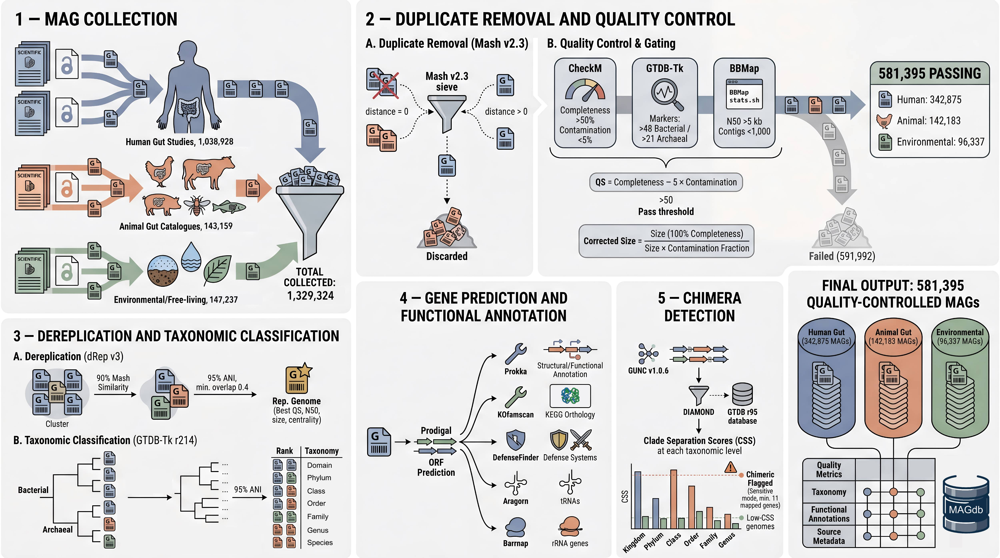

# UniMAG

**A unified catalogue of metagenome-assembled genomes from human gut,
non-human animal gut, and environmental sources.**

<p align="center">
  
</p>

UniMAG compiles **581,395 quality-controlled MAGs** from published studies
and public catalogues across three habitat categories:

| Source | MAGs |
|---|---:|
| Human gut | 342,875 |
| Non-human animal gut | 142,133 |
| Environmental | 96,337 |
| **Total** | **581,345** |

All genomes were de-duplicated with Mash, quality-filtered against
[MIMAG](https://www.nature.com/articles/nbt.3893) standards, taxonomically
classified with GTDB-Tk against
[GTDB release r214](https://gtdb.ecogenomic.org/), and screened for
chimerism with GUNC.

---

## Web interface

The main entry point with search, browse and per-MAG download links:

🔗 **[https://services-ab.cs.uni-tuebingen.de/unimag/](https://services-ab.cs.uni-tuebingen.de/unimag/)**

Features:

- **Search** — filter by genome ID, GTDB taxonomy (any rank), host
  organism, completeness, contamination, or genome size. Live
  autocomplete suggestions; sortable, paginated results.
- **Browse** — drill into the catalogue by top phyla, host species, or
  source × domain.
- **Per-MAG download** — direct S3 links to all six file formats (FAA,
  FFN, FNA, GBK, GFF, TSV).
- **Bulk download** — generate a TSV manifest of every S3 URL matching
  your search filters, pipe it into `wget -i` for batch retrieval. The
  manifest also includes taxonomy and quality metadata, so it doubles as
  a standalone reference table.

---

## Direct data access (S3)

All genome files and pre-computed annotations are hosted on the
[de.NBI Cloud](https://www.denbi.de) S3 service at the University of
Tübingen and are publicly readable without authentication.

**S3 endpoint:** `https://s3-dc2.denbi.uni-tuebingen.de/magdb/`

### Bucket layout

```
s3://magdb/
├── human/                      # 342,875 MAGs
│   ├── human_faa/              # protein sequences (.faa)
│   ├── human_ffn/              # CDS nucleotide sequences (.ffn)
│   ├── human_fna/              # genome assembly (.fna)
│   ├── human_gbk/              # GenBank annotation (.gbk)
│   ├── human_gff/              # GFF3 annotation (.gff)
│   └── human_tsv/              # per-CDS annotation (.tsv)
├── animal/                     # 142,133 MAGs (same six subfolders)
├── environmental/              # 96,337 MAGs (same six subfolders)
├── kofams/                     # KEGG Orthology assignments (KOfamscan)
│   ├── human.txt               # 38.67 GB
│   ├── animal.txt              # 14.46 GB
│   └── environmental.txt       # 13.51 GB
└── defense_systems/            # Anti-phage defence systems (DefenseFinder)
    ├── human.tsv               # 334.91 MB
    ├── animal.tsv              # 147.84 MB
    └── environmental.tsv       # 66.11 MB
```

### URL pattern for individual MAGs

```
https://s3-dc2.denbi.uni-tuebingen.de/magdb/<source>/<source>_<type>/<genome_id>.<type>
```

Examples:

```bash
# A specific human-gut protein file
wget https://s3-dc2.denbi.uni-tuebingen.de/magdb/human/human_faa/GUT000001.faa

# All six file types for one MAG
for t in faa ffn fna gbk gff tsv; do
  wget https://s3-dc2.denbi.uni-tuebingen.de/magdb/human/human_${t}/GUT000001.${t}
done

# Resume-friendly download of a large annotation file
wget -c https://s3-dc2.denbi.uni-tuebingen.de/magdb/kofams/human.txt
curl -O -C - https://s3-dc2.denbi.uni-tuebingen.de/magdb/kofams/human.txt
```

### Using the AWS CLI

If you prefer the `aws s3` commands, the bucket is reachable through the
de.NBI S3 endpoint:

```bash
# Configure once (only the endpoint matters; no credentials needed for read access)
aws configure set default.region us-east-1
aws configure set default.s3.endpoint_url https://s3-dc2.denbi.uni-tuebingen.de

# List the bucket
aws s3 ls s3://magdb/ --endpoint-url https://s3-dc2.denbi.uni-tuebingen.de

# List a subfolder
aws s3 ls s3://magdb/human/human_faa/ --endpoint-url https://s3-dc2.denbi.uni-tuebingen.de

# Download an entire subfolder
aws s3 cp s3://magdb/human/human_faa/ ./human_faa/ --recursive \
    --endpoint-url https://s3-dc2.denbi.uni-tuebingen.de

# Download a single file
aws s3 cp s3://magdb/kofams/human.txt . \
    --endpoint-url https://s3-dc2.denbi.uni-tuebingen.de
```

---

## Genome ID conventions

| Source | ID prefix | Example |
|---|---|---|
| Human gut | `GUT` | `GUT000001` |
| Non-human animal gut | `animal` | `animal000001` |
| Environmental | `FREE` | `FREE000001` |

---

## File formats

| Extension | Format | Contents |
|---|---|---|
| `.fna` | FASTA | Genome assembly contigs (nucleotide) |
| `.faa` | FASTA | Predicted protein sequences |
| `.ffn` | FASTA | Predicted CDS nucleotide sequences |
| `.gff` | GFF3 | Feature annotations |
| `.gbk` | GenBank | Combined annotation file |
| `.tsv` | TSV | Per-CDS annotation table |

ORFs were predicted with Prodigal and annotated with Prokka. KEGG
Orthology assignments come from KOfamscan; anti-phage defence systems
from DefenseFinder.

---

## Issues &amp; feedback

If you find a problem, spot an inaccuracy, or have a feature request,
please let us know &mdash; we read everything and try to act on it
quickly.

- **Bug reports / feature requests:** open a
  [GitHub issue](https://github.com/marshomics/unimag/issues/new). This
  is the preferred channel for anything actionable (broken links,
  incorrect metadata, missing files, ideas for new search filters or
  annotations).
- **Quick questions or sensitive matters:** email
  [james.marsh@tuebingen.mpg.de](mailto:james.marsh@tuebingen.mpg.de).

When reporting a bug, please include:

- the URL of the page or file involved (if any),
- the genome ID(s) affected (if relevant), and
- what you expected to see versus what you actually saw.

---

## Citation


*(Citation details will be updated once published.)*

---

## Contact

**James W. Marsh** —
[james.marsh@tuebingen.mpg.de](mailto:james.marsh@tuebingen.mpg.de)

Max Planck Institute for Biology Tübingen, Max-Planck-Ring 5, 72076
Tübingen, Germany.

For privacy and imprint information, see the
[Imprint](https://services-ab.cs.uni-tuebingen.de/unimag/imprint.php) and
[Privacy](https://services-ab.cs.uni-tuebingen.de/unimag/privacy.php) pages
on the main site.
